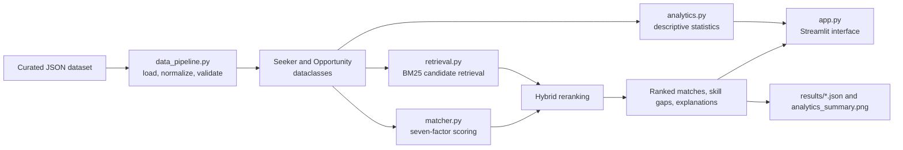

# CS 5542 Challenge 1: Final Big Data Job Search Application Report

**Student:** Vince Nguyen
**Repository:** https://github.com/VinceNguyen000/2026-agentic-ai-job-search
**Development tool:** Antigravity Agentic AI Assistant
**Application:** Agentic AI Job Search and Career Advisory System

## Executive Summary

This project evolved through four stages: Human Design, AI Design, Human-AI Co-Design, and the Final Big Data Application. I designed a job-search system for people who spend too much time manually comparing job postings with their resumes and career goals. The final application combines an explainable seven-factor matching engine, BM25 lexical retrieval, data-quality-aware JSON ingestion, descriptive analytics, skill-gap feedback, an agent workflow, and a Streamlit interface.

The current demonstration dataset is intentionally small: four seeker profiles and six job opportunities. It is not presented as a production-scale dataset. Instead, it provides a reproducible local testbed for the complete workflow. The application produced top-five recommendations for all four seekers, generated analytics and visualization artifacts, and passed 14 automated tests. On this dataset, weighted matching averaged 2.7488 ms per seeker and the maximum measured time was 3.7977 ms.

## 1. Problem Definition and Big Data Goal

The target users are job seekers searching across many online job postings. The problem is that manual searching is slow, inconsistent, and difficult when a candidate has several priorities at once. A useful system must compare technical skills, experience, location, salary, work preferences, and long-term goals instead of matching only a job title.

Seeker inputs include career goals, industry interests, experience level, education, skills, certifications, preferred locations, relocation willingness, work mode, work type, salary expectations, and availability. Job records include title, company, description, responsibilities, required and preferred skills, experience level, education, certifications, locations, relocation rules, work mode, work type, salary range, benefits, and dates.

Expected outputs are a match percentage from 0 to 100, a score breakdown, matched skills, missing skills, an explanation, ranked job recommendations, application material, and an upskilling roadmap. Successful matching means producing a realistic and explainable ranking rather than a score that is impossible to interpret.

The problem has the five characteristics of big data:

- **Volume:** Real job platforms contain millions of postings and resumes.
- **Velocity:** Postings are added, edited, closed, and expired continuously.
- **Variety:** Data combines structured fields, free-text descriptions, resumes, skills, salaries, locations, and preferences.
- **Veracity:** Sources contain missing values, duplicates, inconsistent skill names, outdated postings, and different salary formats.
- **Value:** The system turns large collections of listings into personalized recommendations and actionable skill-gap guidance.

The intended production flow is:

```text
Job sources -> ingestion -> storage -> cleaning -> transformation
-> search and analytics -> matching -> recommendation -> visualization
```

## 2. Stage 1: Human Design

Before using AI-generated solutions, I designed a sequential rule-based workflow. Seeker features and opportunity features would enter a matching block. Each criterion would produce a normalized score, the scores would be multiplied by fixed weights, and the final percentage would produce feedback and ranked jobs.

The seven original criteria were skills at 30%, experience at 25%, location at 15%, salary at 15%, work mode at 5%, work type at 5%, and career goals at 5%. Skills and career goals used keyword overlap. Experience used level keywords. Salary used numerical range comparisons. Location, work mode, and work type used mostly binary compatibility rules.

The original design assumed that structured fields could be compared directly. It was intentionally explainable, but it had limitations. Exact keywords could miss synonyms, binary location rules could be too rigid, and a short goal compared with a long job description could receive an unfairly low similarity score. The original design also did not specify a scalable ingestion system, external data source, semantic retrieval, or a user interface beyond the workflow diagram.

The original workflow is preserved in [human-design.drawio.png](human-design.drawio.png).

## 3. Stage 2: AI Design

I asked Antigravity to implement a seven-criterion weighted matching algorithm using Python data classes for `Seeker`, `Opportunity`, and `MatchResult`. I also asked it to create an autonomous job-search agent with tools for profile lookup, opportunity search, fit evaluation, skill-gap diagnosis, application drafting, and upskilling-roadmap generation.

The AI proposed a modular architecture with `models.py`, `matcher.py`, `agent.py`, `utils.py`, and `main.py`, plus JSON examples, serialized results, and a test suite. It generated an executable local application with CLI modes for matching and agent execution. The agent chains profile inspection, job search, weighted evaluation, missing-skill analysis, tailored application drafting, and roadmap generation.

AI improved implementation speed, modularity, documentation, and the transition from a static formula to an actionable career assistant. It also suggested useful technology aliases and a hierarchy for experience levels.

However, the first generated logic had two important problems. First, it used a Jaccard-style union denominator against an entire job description. A short career goal could therefore receive almost no credit even when the job was clearly relevant. Second, a minimum token length removed important two-letter terms such as AI, ML, and JS. These problems demonstrated that executable code can still produce misleading results.

The AI-generated local architecture did not address production-scale processing. It used local JSON files and in-memory Python objects. That was appropriate for an MVP but not for millions of live records. The current final test run has 14 passing tests; earlier development notes reported 17 tests, but I use the current reproducible count of 14 in this final report.

## 4. Stage 3: Human-AI Co-Design

I kept the original problem definition, seven criteria, weighted scoring, feedback, and emphasis on explainability. I accepted AI-generated data classes, modular source files, the agent tool workflow, experience hierarchy, skill aliases, application drafting, and upskilling-roadmap generation.

I rejected or corrected the career-goal denominator and the token-length filtering. I changed career-goal matching to meaningful keyword containment and preserved short technical acronyms. I also added normalization, missing-value handling, duplicate checks, BM25 retrieval, hybrid reranking, descriptive analytics, evaluation artifacts, and a Streamlit interface.

Human judgment was essential because I evaluated whether results represented a real job seeker's situation. The AI could produce code quickly, but I had to decide whether the weights were appropriate, whether an apparently valid formula was misleading, and which extensions were genuinely implemented. I also separated current capabilities from future ideas instead of presenting Spark, embeddings, or live APIs as completed features.

## 5. Big Data Collection, Storage, and Processing

**Dataset name:** Agentic Job Search Demonstration Dataset.

**Source:** Author-created, curated demonstration records distributed with this repository.

**URL status:** There is no external data URL. The repository is the reproducible source, with records in `examples/seekers.json` and `examples/opportunities.json`. The data is not downloaded from LinkedIn, Indeed, Glassdoor, or another external job board.

**Approximate size:** Four seeker profiles, six job opportunities, and 26 required-skill entries. The dataset is small by design and is not evidence of production-scale volume.

The implemented pipeline is:

```text
JSON files -> data_pipeline.py -> validation and normalization
-> Seeker/Opportunity dataclasses -> feature construction
-> BM25 index and weighted matcher -> analytics and recommendations
```

`data_pipeline.py` converts JSON records into typed dataclasses and controlled enum values. It handles missing optional lists with empty lists, missing descriptions with null values, and missing salary information as unknown rather than automatically incompatible. It checks required identifiers and reports duplicate seeker names or job IDs.

Text preprocessing lowercases terms, strips punctuation, removes common stop words, and preserves short technical terms such as AI, ML, JS, and DB. Skill aliases recognize examples such as ML and Machine Learning, AI and Artificial Intelligence, JS and JavaScript, K8s and Kubernetes, and AWS and Amazon Web Services. Required and preferred skills remain separate features.

The local JSON format is appropriate because it is readable, portable, and reproducible without a database server. For a larger application, the same ingestion boundary could connect to approved APIs, a relational database, cloud object storage, or a distributed batch pipeline. Explicit duplicate resolution and stronger record-level data quality rules would be required before production use.

## 6. Analytics and Matching Method

The final matching score is:

```text
Final Match = Skills x 0.30 + Experience x 0.25 + Location x 0.15
			+ Salary x 0.15 + Work Mode x 0.05
			+ Work Type x 0.05 + Career Goals x 0.05
```

Skills compare required and preferred qualifications, with required skills receiving the main score and preferred skills receiving a smaller bonus. Experience uses an entry-to-executive hierarchy. Location supports exact compatibility and partial relocation compatibility. Salary uses overlap between seeker and job ranges. Work mode and work type compare controlled preferences. Career goals use meaningful keyword containment over job titles, descriptions, and responsibilities.

BM25 is implemented in `retrieval.py` as a first-stage lexical retriever over job titles, companies, descriptions, responsibilities, and skills. The hybrid workflow retrieves lexical candidates with BM25 and reranks them with the explainable seven-factor matcher. This combines text relevance with candidate-specific constraints.

The runtime agent is a deterministic Python tool-orchestration workflow. Antigravity was used during development to generate, debug, and improve the system; the final runtime does not call an external LLM. The agent coordinates profile inspection, opportunity search, fit evaluation, skill-gap analysis, application drafting, and roadmap generation.

## 7. Big Data Analytics and Visualization

The analytics pipeline reports required-skill frequency, job titles, locations, work-mode distribution, experience requirements, and salary summaries. Current results include:

| Metric | Current result |
| :--- | :--- |
| Seekers | 4 |
| Opportunities | 6 |
| Required-skill entries | 26 |
| Most requested required skill | Python, 3 postings |
| Work modes | 4 hybrid, 2 remote |
| Experience levels | 5 junior, 1 senior |
| Average minimum salary | $105,500 |
| Average maximum salary | $144,333.33 |
| Observed salary range | $75,000 to $220,000 |

The generated visualization [results/analytics_summary.png](results/analytics_summary.png) contains panels for most requested skills, work-mode distribution, experience levels, and locations. The Streamlit interface also displays interactive skill and work-mode charts.

## 8. Final Application

The final end-to-end application is:

```text
Curated job data -> ingestion and quality checks -> analytics and BM25 index
-> candidate selection -> retrieval -> seven-factor matching
-> ranked recommendations -> score explanation and skill gaps
-> application draft and upskilling roadmap -> Streamlit visualization
```

The Streamlit application in [app.py](app.py) lets a user select a seeker, choose weighted matching or BM25 plus weighted reranking, set a minimum score, inspect ranked opportunities, view component score charts, and see matched and missing skills. The final application screenshot is [results/Screenshot Streamlit.png](results/Screenshot%20Streamlit.png).

The command-line interface remains available for reproducibility:

```powershell
python main.py --analytics --hybrid
streamlit run app.py
```

## 9. Results and Evaluation

The application produced top-five recommendations for all four seekers. The strongest top matches were:

| Seeker | Top recommendation | Overall match |
| :--- | :--- | :---: |
| Alice Johnson | Senior Machine Learning Engineer, TechCorp AI | 95.33% |
| Bob Smith | Full Stack JavaScript Developer, StartUp Innovations | 96.25% |
| Carol Davis | Product Manager - Consumer Apps, MobileFirst Corp | 96.25% |
| Vince Nguyen | Cybersecurity SOC Analyst, Enterprise Cyber Defense Corp | 95.25% |

The weighted matcher averaged 2.7488 ms per seeker and reached a maximum measured time of 3.7977 ms on the current local dataset. These timings are prototype measurements, not production-scale performance claims.

### Keyword, BM25, and Hybrid Comparison

The keyword baseline is the original explainable weighted matcher over the complete opportunity list. BM25 is the lexical retrieval stage. Hybrid means BM25 retrieval followed by seven-factor weighted reranking.

| Method | Behavior | Top-1 results for Alice, Bob, Carol, Vince | Top-1 agreement | Evidence | Limitation |
| :--- | :--- | :--- | :---: | :--- | :--- |
| Keyword + weighted matcher | Scores all opportunities using keyword, skill, preference, salary, and experience rules. | JOB001, JOB002, JOB003, JOB006 | 4/4 | 2.7488 ms average weighted-match time | Exact wording can miss semantic equivalents. |
| BM25 retrieval | Uses term frequency, inverse document frequency, and document-length normalization. | JOB001, JOB002, JOB003, JOB006 | 4/4 | BM25 scores in `results/hybrid_retrieval_report.json` | No embeddings or semantic understanding. |
| Hybrid BM25 + weighted reranking | Retrieves lexical candidates, then applies candidate-specific weighted fit scoring. | JOB001, JOB002, JOB003, JOB006 | 4/4 | BM25 and final scores in `results/hybrid_retrieval_report.json` | No external relevance labels or large benchmark. |

All three methods identify the expected profile-specific role at rank one on this curated sample. This demonstrates functionality, not statistical superiority. A larger external dataset with human relevance labels is required for Precision@K, recall, ranking agreement, and scalability claims.

## 10. Human vs. AI vs. Human-AI Comparison

| Aspect | Human Design | AI Design | Human-AI Co-Design |
| :--- | :--- | :--- | :--- |
| Problem understanding | Defined target users, inputs, outputs, and seven criteria. | Converted requirements into Python classes, a matcher, and agent tools. | Preserved the goal and evaluated whether scores represented realistic job fit. |
| Big-data architecture | Designed the conceptual flow from job data to matching and feedback. | Proposed a modular local JSON and Python architecture. | Added ingestion, analytics, BM25 retrieval, hybrid reranking, and Streamlit while identifying future scale options. |
| Data processing | Used structured fields, keyword preprocessing, and direct comparison. | Generated JSON loading, dataclasses, tokenization, and aliases. | Added normalization, defaults, identifier checks, duplicate detection, and quality reports. |
| Analytics | Planned keyword overlap, experience, salary, and weighted scoring. | Implemented scoring and explanations. | Added descriptive statistics, visualization, evaluation artifacts, and timing. |
| Matching/retrieval | Used transparent weighted keyword matching. | Added hierarchy, bonuses, aliases, skill gaps, and agent execution. | Preserved explainability and added BM25 plus weighted reranking. |
| Scalability | Recognized Volume, Velocity, Variety, Veracity, and Value. | Produced an executable local MVP but not distributed processing. | Created extension boundaries while documenting the current dataset limitation. |
| Code quality | Supplied rules, priorities, assumptions, and limitations. | Generated modules, documentation, and tests quickly. | Corrected defects, added regression tests, and separated responsibilities across modules. |
| Final quality | Produced a clear but limited matching concept. | Produced an agent-enabled working MVP. | Produced a reproducible application with retrieval, analytics, interface, explanations, and tests. |

AI was most useful for rapid implementation and code structuring. Human judgment was essential for debugging the career-goal score, preserving important acronyms, evaluating realistic results, and distinguishing implemented features from future proposals.

## 11. GitHub and Reproducibility

The repository contains:

- [README.md](README.md) with setup, architecture, commands, and methods;
- [requirements.txt](requirements.txt) with Python dependencies;
- [src/models.py](src/models.py), [src/matcher.py](src/matcher.py), [src/utils.py](src/utils.py), [src/agent.py](src/agent.py), [src/data_pipeline.py](src/data_pipeline.py), [src/retrieval.py](src/retrieval.py), and [src/analytics.py](src/analytics.py);
- [app.py](app.py) for the Streamlit application;
- JSON data in `examples/`;
- reproducible result files in `results/`;
- [results/Screenshot Streamlit.png](results/Screenshot%20Streamlit.png) and [results/analytics_summary.png](results/analytics_summary.png) as visual evidence;
- automated tests in `tests/`.

The final reproducible commands are:

```powershell
pip install -r requirements.txt
python -m unittest discover -s tests -p "test_*.py" -v
python main.py --analytics --hybrid
streamlit run app.py
```

The final test run passed **14 tests**. Earlier development notes mentioned 17 tests, but the report uses the current executable result as the authoritative count.

## 12. Discussion, Limitations, and Conclusion

Human Design taught me the importance of defining the problem, weights, outputs, and limitations before writing code. AI contributed speed, modular architecture, debugging suggestions, agent tools, and documentation. Its limitations were visible when generated formulas produced plausible but misleading scores and when token filtering removed meaningful technical acronyms.

Human-AI co-design improved the system by combining human evaluation with AI implementation. The result is more useful than the initial static formula because it supports skill-gap feedback, tailored application drafts, upskilling recommendations, retrieval, analytics, and an interactive interface. It is also more trustworthy because the weighted score remains deterministic and explainable.

The current limitations are the small author-created dataset, local JSON storage, lexical rather than semantic retrieval, absence of live updates, lack of external relevance labels, no distributed processing, and no formal fairness evaluation. The system also does not yet implement embeddings, cosine similarity, Spark, streaming, live job APIs, cloud storage, or a vector database.

These are future extensions, not current claims. Spark or PySpark could support distributed cleaning and batch scoring. Live APIs and streaming could address job-posting velocity. Embedding models and a vector database could support semantic retrieval. A future production hybrid system could combine BM25, embeddings, skill similarity, and the current seven-factor reranker, followed by evaluation on a larger external dataset with relevance labels and bias measurements.

Overall, the project demonstrates the complete progression required by the assignment: independent problem design, AI-assisted implementation, critical evaluation of AI output, human-AI refinement, data processing, analytics, recommendation, visualization, and reproducible testing.

## Project Architecture

The final application is organized as an ingestion, retrieval, matching, analytics, and interface pipeline:



The main implemented modules are `data_pipeline.py`, `retrieval.py`, `matcher.py`, `analytics.py`, `agent.py`, and `app.py`. The generated evidence includes `results/analytics_report.json`, `results/evaluation_report.json`, `results/hybrid_retrieval_report.json`, `results/analytics_summary.png`, and `results/Screenshot Streamlit.png`.

## Dataset, Source, and Processing

**Dataset name:** Agentic Job Search Demonstration Dataset.

**Source:** Author-created, curated demonstration records distributed with this repository. The data is not downloaded from LinkedIn, Indeed, Glassdoor, or another external job board.

**URL status:** There is no external source URL for this curated dataset. The repository is the reproducible source, with data stored in `examples/seekers.json` and `examples/opportunities.json`.

**Current size:** 4 seeker profiles, 6 job opportunities, and 26 required-skill entries. The opportunity records include titles, companies, descriptions, responsibilities, required and preferred skills, experience, education, certifications, locations, relocation rules, work mode, work type, salary ranges, benefits, and dates. Seeker records include goals, industries, experience, skills, certifications, education, locations, relocation preference, work preferences, salary expectations, and availability.

The processing flow is:

```text
JSON records -> ingestion -> enum conversion and normalization
-> missing-value defaults and duplicate checks -> typed dataclasses
-> keyword features and BM25 index -> weighted matching and analytics
```

The ingestion layer handles absent lists with empty-list defaults, absent optional text with empty or null values, and absent salary data as unknown rather than an automatic mismatch. It checks required identifiers and reports duplicate seeker names or job IDs. Text preprocessing lowercases terms, removes punctuation and stop words, and preserves short technical terms such as `AI`, `ML`, and `JS`. Required and preferred skills remain separate features so their scoring weights can differ.

The small local JSON format is appropriate for a reproducible prototype and makes the data easy to inspect. It is not a production-scale storage solution. A future deployment would replace the local files with approved job APIs, database storage, or cloud object storage while keeping the typed ingestion interface.

## Analytics and Matching Method

The final recommendation score combines seven normalized criteria:

```text
Skills 30% + Experience 25% + Location 15% + Salary 15%
+ Work mode 5% + Work type 5% + Career goals 5%
```

The matcher performs skill alias matching, experience hierarchy comparison, location and relocation checks, salary-range overlap, work-mode and work-type compatibility, and career-goal keyword containment. It returns the overall score, component scores, matched skills, missing skills, an explanation, and a recommendation.

BM25 is implemented as a first-stage lexical retriever over job title, company, description, responsibilities, and skill fields. The hybrid workflow retrieves lexical candidates with BM25 and reranks them with the explainable seven-factor matcher. This combines text relevance with candidate-specific constraints.

The runtime agent is a deterministic Python tool-orchestration workflow. Antigravity was used during development to generate, debug, and improve the system; the final runtime does not call an external LLM. The agent coordinates profile inspection, opportunity search, fit evaluation, skill-gap analysis, application drafting, and upskilling-roadmap generation.

## Keyword, BM25, and Hybrid Comparison

The following comparison uses the four curated seeker profiles. The keyword baseline is the original explainable weighted matcher operating over the complete opportunity list. BM25 is the lexical retrieval stage. Hybrid means BM25 retrieval followed by seven-factor weighted reranking. Because the dataset is curated and small, these results demonstrate functionality rather than statistically reliable generalization.

| Method | Retrieval or ranking behavior | Top-1 results for Alice, Bob, Carol, and Vince | Top-1 agreement | Measured evidence | Limitation |
| :--- | :--- | :--- | :---: | :--- | :--- |
| Keyword + weighted matcher | Scores every opportunity with normalized keyword, skill, preference, salary, and experience rules. | JOB001, JOB002, JOB003, JOB006 | 4/4 profiles | Average weighted-match time: 2.7488 ms; maximum: 3.7977 ms | Lexical wording and curated fields can miss semantic equivalents. |
| BM25 retrieval | Ranks job documents using term frequency, inverse document frequency, and document-length normalization. | JOB001, JOB002, JOB003, JOB006 | 4/4 profiles | BM25 scores are recorded in `hybrid_retrieval_report.json`. | No semantic embeddings; retrieval quality depends on token overlap. |
| Hybrid BM25 + weighted reranking | Retrieves lexical candidates, then applies the seven-factor fit score and explanations. | JOB001, JOB002, JOB003, JOB006 | 4/4 profiles | `hybrid_retrieval_report.json` records BM25 and final match scores. | No external relevance labels or large-scale benchmark yet. |

For the current sample, all three approaches identify the expected profile-specific role at rank one. The hybrid method is still useful because it provides a scalable retrieval boundary and preserves the explainability of the weighted matcher. A larger externally sourced dataset and human relevance labels are required before claiming that BM25 or hybrid retrieval is statistically superior.

## Results and Reproducibility

The current evaluation generated top-five recommendations for all four seekers. The strongest top matches were Alice to the Senior Machine Learning Engineer role at 95.33%, Bob to the Full Stack JavaScript Developer role at 96.25%, Carol to the Product Manager role at 96.25%, and Vince to the Cybersecurity SOC Analyst role at 95.25%.

The project contains 14 passing automated tests covering models, utilities, data ingestion, BM25 retrieval, hybrid reranking, analytics summaries, and recommendation evaluation. The commands used to reproduce the evidence are:

```powershell
python -m unittest discover -s tests -p "test_*.py" -v
python main.py --analytics --hybrid
streamlit run app.py
```

The final interface screenshot is stored at `results/Screenshot Streamlit.png`. It shows candidate selection, weighted and BM25-hybrid retrieval modes, ranked recommendations, match percentages, and analytics charts. The analytics visualization is stored at `results/analytics_summary.png`.

## Scope and Future Extensions

The current implementation does **not** claim to implement Spark, embeddings, semantic vector search, live job APIs, streaming ingestion, cloud storage, or a vector database. These are future extensions rather than current features.

For production scale, Spark or PySpark could distribute cleaning, feature construction, and batch scoring across millions of listings. Live APIs or streaming ingestion could address job-posting velocity. Embedding models and a vector database could add semantic retrieval for related terms that do not share exact keywords. A future hybrid system could combine BM25, embeddings, skill similarity, and the existing seven-factor reranker. Those extensions would require a larger external dataset, relevance labels, latency measurements, duplicate-resolution policies, and bias or fairness evaluation.
