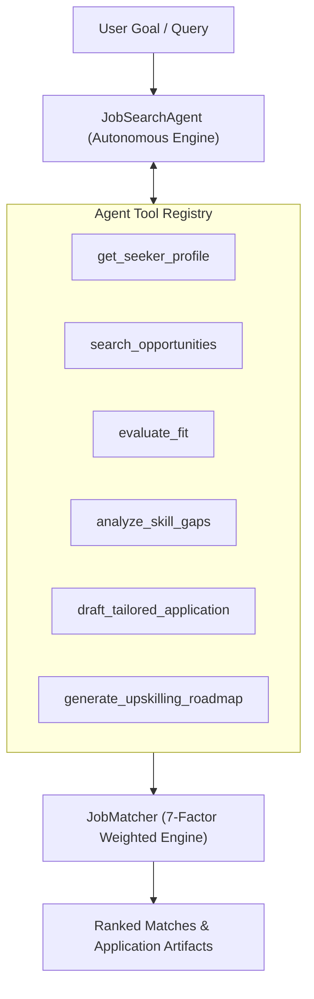

# 2026 Agentic AI Job Search System

An autonomous, multi-agent AI job matching and career advancement platform built with **Antigravity** for **CS 5542 Challenge 1**.

## Project Overview

This project implements an **Agentic AI Job Search System** featuring:

1. **Autonomous JobSearchAgent**: A tool-executing AI agent that parses goals, inspects candidate profiles, matches opportunities, diagnoses skill gaps, drafts customized cover letters, and generates multi-week upskilling roadmaps.
2. **7-Factor Weighted Matching Engine**: A deterministic scoring engine evaluating skills, experience hierarchy, geographic compatibility, salary overlap, work mode, work type, and career goal alignment.
3. **Automated Test Suite**: Zero-dependency `unittest` test suite covering models, matching rules, token containment, and agent tool execution.
4. **Personal Hybrid RAG**: Local career evidence chunks are retrieved with BM25 plus deterministic dense-vector cosine similarity, then supplied to job-specific evidence analysis.

## Key Features & Architecture



### Agentic Capabilities & Tools

- **`search_opportunities`** - Filters listings dynamically by keywords, work mode, location, and salary.
- **`evaluate_fit`** - Computes multi-dimensional compatibility scores.
- **`analyze_skill_gaps`** - Flags missing required and preferred skills with remediation steps.
- **`draft_tailored_application`** - Generates tailored cover letters and elevator pitches emphasizing top strengths.
- **`generate_upskilling_roadmap`** - Analyzes market trends and outputs a 6-week progressive upskilling curriculum.

---

## Getting Started

### 1. Installation

```bash
git clone https://github.com/VinceNguyen000/2026-agentic-ai-job-search.git
cd 2026-agentic-ai-job-search
```

### 2. Run Autonomous Agent & Matcher Demonstration

```bash
# Run both algorithmic matching and autonomous agent demonstration
python main.py

# Run only the autonomous agent workflow
python main.py --agent

# Generate analytics, evaluation results, and a PNG visualization
python main.py --analytics

# Evaluate BM25 retrieval followed by weighted reranking
python main.py --hybrid

# Launch the interactive application
streamlit run app.py

# Run a custom natural language goal
python main.py --goal "Find top ML opportunities for Alice and draft an application" --seeker "Alice Johnson"
```

### 3. Run Automated Tests

```bash
python -m unittest discover -s tests -p "test_*.py" -v
```

## Deploy to Hugging Face Static Spaces

This repository includes a browser-based static demonstration for accounts that
cannot use paid Docker or Gradio Spaces. Create a new Space at
<https://huggingface.co/new-space>, select **Static**, and upload or push the
repository files. The Space serves `index.html` automatically.

The static demonstration uses `app.js` to calculate the transparent weighted
baseline in the browser. The full Python Streamlit implementation remains in
`app.py` for local execution and reproducible testing. The static demo uses
anonymized seekers from `public-data/seekers.json`; do not publish `data/personal/`
or real contact information in a public Space.

For a Git-based workflow, clone the Space repository, copy `index.html`,
`app.js`, `styles.css`, `public-data/`, and the compatible `local-data/` directory
into it, then commit and push. Every push updates the static Space.

## Optional External Embeddings and LLM

The Python agent supports the external five-stage Career RAG pipeline when
`USE_EXTERNAL_AI=1` and `GEMINI_API_KEY` are present. It uses Gemini
`text-embedding-004` for 768-dimensional career-evidence vectors and Gemini
`gemini-2.0-flash` for evidence-grounded synthesis. Deterministic seven-factor
matching remains authoritative; the LLM explains the result rather than changing
the score. Without the switch or a working API request, the system falls back to
the local hashed-vector encoder and deterministic synthesis.

Run locally after creating a new Gemini key:

```powershell
$env:USE_EXTERNAL_AI="1"
$env:GEMINI_API_KEY="your-new-key"
python main.py --agent --seeker "Vince Nguyen"
```

Never place the key in `app.js`, `index.html`, a public Static Space, or GitHub.
For hosted Python deployments, store it as a private Space secret instead.

### Usage

```python
from src.matcher import JobMatcher
from src.models import Seeker, Opportunity

# Create a seeker profile
seeker = Seeker(
    name="John Doe",
    skills=["Python", "Data Analysis", "SQL"],
    experience_level="junior",
    location="San Francisco, CA",
    work_mode="remote"
)

# Create a job opportunity
job = Opportunity(
    title="Data Analyst",
    required_skills=["Python", "SQL", "Tableau"],
    experience_level="junior",
    location="San Francisco, CA",
    work_mode="remote"
)

# Calculate match
matcher = JobMatcher()
match_score = matcher.calculate_match(seeker, job)
recommendations = matcher.get_recommendations(seeker, job)
```

## Matching Methodology

The matching algorithm employs a **weighted scoring approach** where each criterion is normalized to a 0-100% scale, then combined using predefined weights:

```
Total Match % = (Skill Score × 0.30) + (Experience × 0.25) +
                (Location × 0.15) + (Salary × 0.15) +
                (Work Mode × 0.05) + (Work Type × 0.05) +
                (Career Goals × 0.05)
```

See [ALGORITHM.md](./ALGORITHM.md) for detailed methodology.

## Implementation Details

### Source Code Structure

#### Core Modules

- **`models.py`** - Data classes for Seeker, Opportunity, and MatchResult with enums for ExperienceLevel, WorkMode, and WorkType
- **`matcher.py`** - JobMatcher class implementing the 7-dimensional weighted matching algorithm with helper methods for each criterion
- **`utils.py`** - Utility functions for skill matching, salary calculation, and report generation
- **`data_pipeline.py`** - JSON ingestion, normalization, enum conversion, missing-value checks, and duplicate detection
- **`retrieval.py`** - Lightweight BM25 retrieval and hybrid retrieval plus weighted reranking
- **`rag.py`** - Personal career knowledge-base chunking, hard gating, hybrid evidence retrieval, and context construction
- **`analytics.py`** - Dataset summaries, recommendation evaluation, timing measurements, and visualization generation
- **`app.py`** - Streamlit interface for candidate selection, ranking, explanations, and analytics

#### Data Files

- **`local-data/seekers.json`** - Local sample seeker profiles with diverse skills, preferences, and goals
- **`local-data/opportunities.json`** - Local fallback job listings representing different roles and experience levels
- **`results/sample_matches.json`** - Pre-computed match results showing algorithm output
- **`results/analytics_report.json`** - Descriptive statistics for the job dataset
- **`results/evaluation_report.json`** - Top-k recommendations and measured matching time
- **`results/hybrid_retrieval_report.json`** - BM25 retrieval and weighted reranking results
- **`results/personal_rag_evidence.json`** - Personal hybrid-RAG evidence for each top recommendation
- **`results/analytics_summary.png`** - Four-panel visualization of skills, work modes, experience, and locations
- **`results/Screenshot Streamlit.png`** - Final application screenshot showing the interactive matching interface

### Key Implementation Features

1. **Intelligent Skill Matching**
   - Case-insensitive exact matching
   - Common abbreviation recognition (JS↔JavaScript, ML↔Machine Learning, etc.)
   - Preferred skills bonus scoring
   - See ALGORITHM.md for detailed methodology

2. **Experience Level Alignment**
   - 5-level hierarchy (Entry → Junior → Senior → Lead → Executive)
   - Partial credit for candidates below required level
   - Full credit for candidates above required level

3. **Multi-Criteria Optimization**
   - Weighted scoring with configurable weights
   - Binary matching for work mode/type (quick decision)
   - Range overlap calculation for salary
   - Keyword-based career goal alignment

4. **Human-Readable Feedback**
   - Detailed explanation of match score
   - Actionable recommendations
   - Skill gap analysis with suggestions

5. **Big Data Application Foundations**
    - Reproducible JSON ingestion and quality reporting
    - BM25 lexical retrieval before weighted reranking
    - Personal hybrid RAG over resume, GitHub projects, and preferences
    - Dataset-level analytics and generated visualization
    - Evaluation artifacts with top-k recommendations and processing time

### Running the System

```bash
# Install dependencies
pip install -r requirements.txt

# Run example matching
python main.py

# Regenerate report artifacts
python main.py --analytics --hybrid

# Export the final report to Word and PDF
python export_report.py
```

The current demonstration dataset contains four seeker profiles and six job
opportunities. It is intentionally small and curated so the full workflow is
reproducible locally. The ingestion boundary is designed to support a future
API, database, cloud object store, or Spark-based batch pipeline without
changing the matching interface.

The current personal RAG index contains 13 locally generated chunks. It uses
BM25 plus deterministic 256-dimensional hashed dense vectors and does not call
Gemini, Hugging Face, Tavily, an external embedding API, or a vector database.

The consolidated submission report is [CHALLENGE1_FINAL_REPORT.md](CHALLENGE1_FINAL_REPORT.md).
Generated exports are [results/CHALLENGE1_FINAL_REPORT.docx](results/CHALLENGE1_FINAL_REPORT.docx)
and [results/CHALLENGE1_FINAL_REPORT.pdf](results/CHALLENGE1_FINAL_REPORT.pdf).

## Agentic AI Insights

### What Worked Well

✅ **Rapid prototyping** - Generated complete data models and matching logic efficiently  
✅ **Documentation** - AI produced clear, comprehensive technical documentation  
✅ **Code quality** - Generated code followed Python best practices  
✅ **Example data** - Realistic seeker/opportunity profiles with varied characteristics  
✅ **Iterative refinement** - Easy to adjust weights and algorithm parameters

### Challenges Overcome

⚠️ **Semantic understanding** - Required detailed prompts to ensure correct logic  
⚠️ **Edge case handling** - Needed explicit guidance for boundary conditions  
⚠️ **Test coverage** - AI-generated code needed manual validation  
⚠️ **Consistency** - Maintaining naming conventions across generated modules  
⚠️ **Domain specificity** - ML/hiring domain knowledge required careful specification

### Best Practices Discovered

📌 **Clear requirements** - Detailed specifications produced better code  
📌 **Modular design** - Breaking algorithm into separate methods improves clarity  
📌 **Type hints** - Explicit typing helped AI understand data flow  
📌 **Documentation** - Inline comments and docstrings improved output quality  
📌 **Example-driven** - Providing usage examples improved implementation correctness

## Results & Examples

See [results/](./results/) directory for sample matching scenarios and output.

## Future Enhancements

- [ ] Integration with real job APIs (LinkedIn, Indeed, Glassdoor)
- [ ] Machine learning-based skill embeddings for semantic matching
- [ ] User interface for seeker/job browsing and matching
- [ ] Historical matching data for algorithm optimization
- [ ] Bias detection and fairness metrics
- [ ] Scaling to large job databases (100K+ listings)

## Report & Documentation

For detailed information about this hands-on experience, see:

- **[HANDS_ON_REPORT_CHALLENGE1.md](./HANDS_ON_REPORT_CHALLENGE1.md)** - CS 5542 Challenge 1 Hands-On Report: In-class activity using Antigravity showing what was requested, what was generated, what was tested, and what worked/didn't work
- **[ALGORITHM.md](./ALGORITHM.md)** - Technical deep-dive into the matching algorithm with formulas, examples, edge cases, and limitations

## Author

Created as part of CS5542 Agentic AI Challenge 1 Hands-On Activity (September 2026)  
**Developed with:** Antigravity (Agentic AI)

## License

MIT License - See LICENSE file for details
